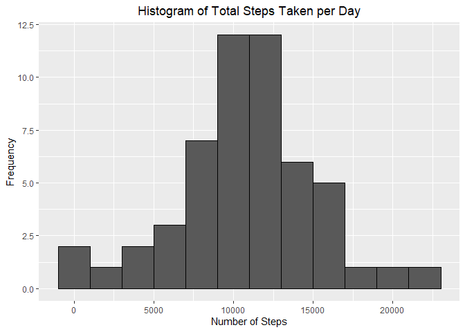
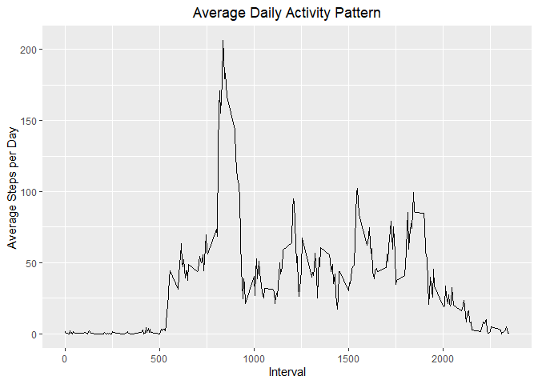
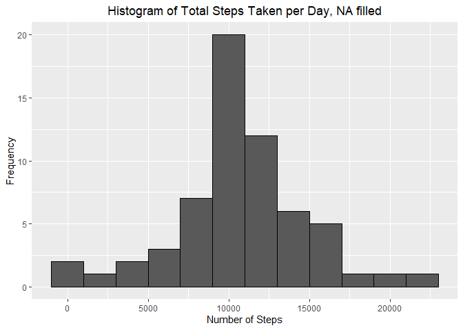
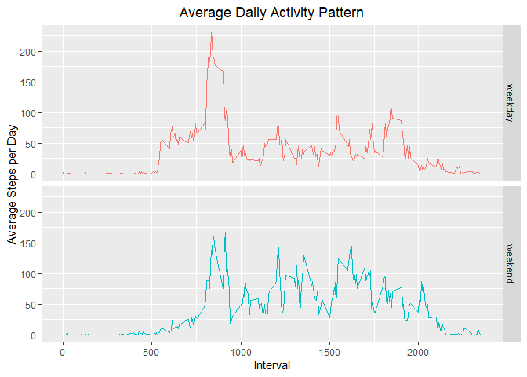

## Loading and preprocessing the data
To start the analysis, ensure the data set "activity.zip" is in your current working directory.  
Let's load the data:

```r
file <- unz("activity.zip", "activity.csv")     # Unzip the file
data <- read.csv((file))
```
Let's have a look on the data set structure.

```r
str(data)
```

```
## 'data.frame':	17568 obs. of  3 variables:
##  $ steps   : int  NA NA NA NA NA NA NA NA NA NA ...
##  $ date    : chr  "2012-10-01" "2012-10-01" "2012-10-01" "2012-10-01" ...
##  $ interval: int  0 5 10 15 20 25 30 35 40 45 ...
```
We see that the data set has a total of 17,568 observations and 3 variables namely:  

- **steps**: Number of steps taking in a 5-minute interval (missing values are coded as `NA`)  
- **date**: The date on which the measurement was taken in YYYY-MM-DD format  
- **interval**: Identifier for the 5-minute interval in which measurement was taken  

Now we transform the *date* variable class from *chr* into *date*, and
the *interval* variable class from *int* to *factor*.

```r
data$date <- as.Date(data$date, format = "%Y-%m-%d")
data$interval <- factor(data$interval)
```

```
## 'data.frame':	17568 obs. of  3 variables:
##  $ steps   : int  NA NA NA NA NA NA NA NA NA NA ...
##  $ date    : Date, format: "2012-10-01" "2012-10-01" ...
##  $ interval: Factor w/ 288 levels "0","5","10","15",..: 1 2 3 4 5 6 7 8 9 10 ...
```
The summary of the data is:

```r
summary(data)
```

```
##      steps             date               interval    
##  Min.   :  0.00   Min.   :2012-10-01   0      :   61  
##  1st Qu.:  0.00   1st Qu.:2012-10-16   5      :   61  
##  Median :  0.00   Median :2012-10-31   10     :   61  
##  Mean   : 37.38   Mean   :2012-10-31   15     :   61  
##  3rd Qu.: 12.00   3rd Qu.:2012-11-15   20     :   61  
##  Max.   :806.00   Max.   :2012-11-30   25     :   61  
##  NA's   :2304                          (Other):17202
```
Take note that there are 2304 NA values in the steps variable.  

## What is mean total number of steps taken per day?
First let's aggregate the data set and calculate the total number of steps taken per day.

```r
stepsDF <- aggregate(steps ~ date, data, FUN = sum)
head(stepsDF)
```

```
##         date steps
## 1 2012-10-02   126
## 2 2012-10-03 11352
## 3 2012-10-04 12116
## 4 2012-10-05 13294
## 5 2012-10-06 15420
## 6 2012-10-07 11015
```
Now let's do a simple exploratory data analysis by checking the frequency distribution
of the *steps*. Using the `ggplot2` package, create a histogram of the `stepsDF`.  

```r
library(ggplot2)

ggplot(data = stepsDF, aes(x = steps)) + 
        geom_histogram(binwidth = 2000, color = "black") +
        labs(title = "Histogram of Total Steps Taken per Day", 
             x = "Number of Steps", y = "Frequency") +
        theme(plot.title = element_text(hjust = 0.5))
```

<!-- -->

We can calculate the mean and median by:  

```r
mean(stepsDF$steps, na.rm = TRUE)
```

```
## [1] 10766.19
```

```r
median(stepsDF$steps, na.rm = TRUE)
```

```
## [1] 10765
```

As expected from the histogram plot above, the mean and median has close values.
## What is the average daily activity pattern?
To find out, we calculate first the average daily steps by 5-minute interval.

```r
averageDaily <- aggregate(steps ~ interval, data, FUN = mean)
averageDaily$interval <- with(averageDaily, as.numeric(levels(interval))[interval])
```
Plotting the time-series...

```r
ggplot(averageDaily, aes(x = interval, y = steps)) + geom_line(group = 1) +
        labs(title = "Average Daily Activity Pattern",
             x = "Interval", y = "Average Steps per Day") +
        theme(plot.title = element_text(hjust = 0.5))
```

<!-- -->

We see that there is a peak on the graph that contains the maximum number of
average steps. The 5-min interval in which it happens is:

```r
with(averageDaily, interval[which.max(steps)])
```

```
## [1] 835
```

## Imputing missing values
Looking back on the summary of our data from above, we note that there are **2304** missing
values (NA) in our data set. A quick check can be done again in this way:

```r
sum(is.na(data$steps))
```

```
## [1] 2304
```

With this information, the presence of this missing values may introduce bias into
some calculations of our data. What would happen to the mean and median total number
of steps taken per day if there were no missing values?  
We can fill-in the missing values by using the mean of the steps per interval
across all days, see `averageDaily` data set.  

```r
combineData <- merge(data, averageDaily, by = "interval")
dfNA <- is.na(combineData$steps.x)
combineData$steps.x[dfNA] <- combineData$steps.y[dfNA]
combineData <- combineData[, c(2, 3, 1)]
```

Let's see if there is still no missing values or NA's in the data set:

```r
summary(combineData)
```

```
##     steps.x            date               interval    
##  Min.   :  0.00   Min.   :2012-10-01   0      :   61  
##  1st Qu.:  0.00   1st Qu.:2012-10-16   5      :   61  
##  Median :  0.00   Median :2012-10-31   10     :   61  
##  Mean   : 37.38   Mean   :2012-10-31   15     :   61  
##  3rd Qu.: 27.00   3rd Qu.:2012-11-15   20     :   61  
##  Max.   :806.00   Max.   :2012-11-30   25     :   61  
##                                        (Other):17202
```
Plotting the histogram of the new data set by the total number of steps taken per day...  

```r
combineSum <- aggregate(steps.x ~ date, data = combineData, sum)
ggplot(data = combineSum, aes(x = steps.x)) + 
        geom_histogram(binwidth = 2000, color = "black") +
        labs(title = "Histogram of Total Steps Taken per Day, NA filled", 
             x = "Number of Steps", y = "Frequency") +
        theme(plot.title = element_text(hjust = 0.5))
```

<!-- -->

Does the new value of the **mean** and **median** different from the previous part?  

```r
mean(combineSum$steps.x)
```

```
## [1] 10766.19
```

```r
median(combineSum$steps.x)
```

```
## [1] 10766.19
```

Based on the results above, we see that there is no significant variation from the old values versus the new values after imputing the missing values. The new **mean** is still the same
and the new **median** moved closer to the mean (i.e. now equal to the mean).  

|      |**OLD**|**NEW**|
|:----:|:-----:|:-----:|
|Mean  | 10766 | 10766 |
|Median| 10765 | 10766 |

## Are there differences in activity patterns between weekdays and weekends?
Let's create a new factor variable in the dataset with two levels - "weekday"
and "weekend" and classify the dates accordingly.  

```r
combineData$Day <- as.factor(ifelse(weekdays(combineData$date) 
                                    %in% c("Saturday", "Sunday"),
                                    yes = "weekend", no = "weekday"))
```
Let's check the table summary of the new factor variable.

```r
table(combineData$Day)
```

```
## 
## weekday weekend 
##   12960    4608
```
To investigate if there is a difference on the activity patterns between weekdays
and weekends, we will plot the average activity patterns between the two level factors.  

```r
combineDaily <- aggregate(steps.x ~ interval + Day, data = combineData, mean)
combineDaily$interval <- with(combineDaily, as.numeric(levels(interval))[interval])

ggplot(combineDaily, aes(x = interval, y = steps.x)) + 
        geom_line(group = 1, aes(color = Day)) +
        facet_grid(Day ~.) +
        labs(title = "Average Daily Activity Pattern",
             x = "Interval", y = "Average Steps per Day") +
        theme(legend.position = "none", plot.title = element_text(hjust = 0.5))
```

<!-- -->

We can observe that the activity is more spread out throughout the day of the weekends,
while the spike on activity is seen on the earlier part (i.e. morning) of the weekday.
